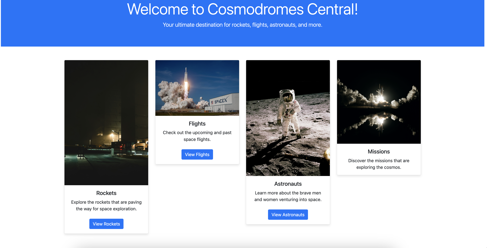

# cosmodrome

# Introduction
Welcome to our Django-based application. This project, known as the Cosmodrome Project, is designed to manage rockets, astronauts and flights with a streamlined user interface. It provides features such as rocket, astronaut and flight creation, user management, and pagination.

# Site is also already hosted on a free platfom, here is the link:
[cosmodrome deployed on render](https://cosmodrome.onrender.com)

# Key Features
1) Launch Management
- Create, View, and Edit Launches: Users can schedule new rocket launches, view detailed launch information, and edit existing launch schedules effortlessly.
- Pagination: Navigate through the list of scheduled launches with pagination for improved performance and ease of use.

2) Astronaut Management
- Astronaut Creation: Admins can onboard new astronauts through a dedicated form, streamlining the process of adding new crew members.
- Astronaut Information: View and update astronaut profiles to manage their details and mission assignments effectively.

3) Rockets Management
- Tag Creation and Management: Add and manage rockets for flight, improving the organization and searchability of various space missions and operations.

# Installation Instructions
```sh
# Clone the repository
git clone https://github.com/Timur5050/cosmodrome.git
# Change to the project directory
cd cosmodrome
# Create a virtual environment
python -m venv env
# Activate the virtual environment
# On Windows
env\Scripts\activate
# On macOS/Linux
source env/bin/activate
# Install required packages
pip install -r requirements.txt
# Apply migrations
python manage.py migrate
# Run the development server
python manage.py runserver
# Open the project in your web
# Go to http://127.0.0.1:8000/
```

# Usage Guide
- Main Page, URL: /, View: index. This is the main landing page of the application.
- User Registration, URL: /registration/, View: user_creation_view. Allows users to register a new account.
- User Profile, URL: /profile/<int:pk>/, View: user_profile_view. Displays information about a specific user.
- Racket List, URL: /rackets/, View: racket_list_view. Displays a list of rackets, with pagination.
- Racket Creation, URL: /rackets/create/, View: racket_create_view. Allows users to create a new racket.
- Racket Details, URL: /rackets/<int:pk>/details/, View: racket_details. Displays the details of a specific racket.
- Astronaut List, URL: /astronauts/, View: astronaut_list_view. Displays a list of astronauts, with pagination.
- Astronaut Creation, URL: /astronauts/create/, View: astronaut_create_view. Allows users to create a new astronaut.
- Astronaut Details, URL: /astronauts/<int:pk>/details/, View: astronaut_details. Displays the details of a specific astronaut.
- Flight List, URL: /flights/, View: flight_list_view. Displays a list of flights, with pagination.
- Flight Creation, URL: /flights/create/, View: flight_list_create. Allows users to create a new flight.
- Flight Details, URL: /flights/<int:pk>/details/, View: flight_details. Displays the details of a specific flight.


# demo


